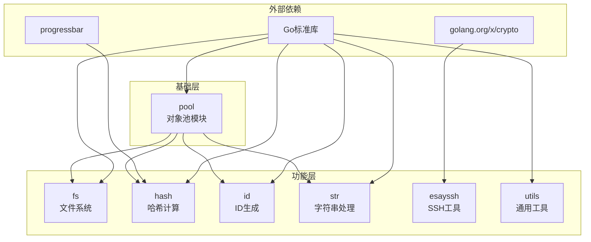

# Go-Kit 项目分析报告

> 生成时间: 2026-02-16  
> 分析范围: 完整代码库架构与实现  
> 项目地址: https://gitee.com/MM-Q/go-kit

---

## 一、项目概述

### 1.1 项目定位
Go-Kit 是一个**高性能 Go 语言工具包**，集成了开发过程中常用的实用工具和组件，旨在提高开发效率、减少重复代码，为 Go 开发者提供一套完整的基础工具集。

### 1.2 核心指标

| 指标 | 数值 |
|------|------|
| Go 版本 | 1.25.0 |
| 核心模块数 | 7 个 |
| 源码文件数 | 46 个 .go 文件 |
| 测试覆盖 | 各模块均有独立测试文件 |
| 许可证 | MIT |

---

## 二、目录结构梳理

### 2.1 完整目录树

```
go-kit/
├── esayssh/                    # SSH工具模块
│   ├── esayssh.go             # 核心SSH管理器实现
│   ├── ssh.go                 # SSH协议底层实现
│   └── types.go               # 数据结构定义
├── fs/                         # 文件系统工具模块
│   ├── copy.go                # 文件/目录复制
│   ├── move.go                # 文件/目录移动
│   ├── fs.go                  # 核心文件操作
│   ├── check.go               # 路径检查
│   ├── attr.go                # 文件属性接口
│   ├── attr_unix.go           # Unix平台属性实现
│   ├── attr_windows.go        # Windows平台属性实现
│   ├── path.go                # 路径处理功能
│   ├── collect.go             # 文件收集功能
│   ├── APIDOC.md             # API文档
│   └── *_test.go             # 单元测试
├── hash/                       # 哈希工具模块
│   └── hash.go                # 多算法哈希计算
├── id/                         # ID生成器模块
│   └── id.go                  # UUID/时间戳ID生成
├── pool/                       # 对象池模块（核心基础模块）
│   ├── buffer.go              # bytes.Buffer对象池
│   ├── byte.go                # 字节切片对象池
│   ├── string.go              # strings.Builder对象池
│   ├── rand.go                # 随机数生成器池
│   ├── timer.go               # 定时器对象池
│   └── utils.go               # 缓冲区计算工具
├── str/                        # 字符串工具模块
│   └── str.go                 # 字符串处理函数
├── utils/                      # 通用工具模块
│   ├── utils.go               # 字节格式化工具
│   └── json.go                # JSON转义工具
├── go.mod                      # Go模块定义
├── go.sum                      # 依赖校验文件
├── LICENSE                     # MIT许可证
└── README.md                   # 项目说明文档
```

### 2.2 目录用途说明

| 目录 | 核心用途 | 规范程度 |
|------|----------|----------|
| `esayssh/` | 多主机SSH连接、批量命令执行、连通性测试 | ★★★★★ 遵循Go标准项目布局 |
| `fs/` | 文件操作、目录遍历、跨平台复制、路径检查 | ★★★★★ 支持Unix/Windows双平台 |
| `hash/` | MD5/SHA1/SHA256/SHA512哈希计算、带进度条计算 | ★★★★★ 算法可扩展设计 |
| `id/` | UUID生成、时间戳ID、随机字符串、带前缀ID | ★★★★★ 高并发安全 |
| `pool/` | 对象池管理、缓冲区复用、性能优化 | ★★★★★ 核心基础模块，设计精良 |
| `str/` | 字符串构建、截断、掩码、模板替换、Base64 | ★★★★★ 功能全面 |
| `utils/` | 字节格式化、JSON转义 | ★★★★☆ 功能单一但实现优秀 |

### 2.3 关键文件识别

| 文件 | 作用 | 重要性 |
|------|------|--------|
| `pool/buffer.go` | 全局缓冲区池，其他模块核心依赖 | ⭐⭐⭐⭐⭐ |
| `pool/byte.go` | 字节切片对象池，文件操作核心 | ⭐⭐⭐⭐⭐ |
| `pool/utils.go` | 动态缓冲区大小计算策略 | ⭐⭐⭐⭐ |
| `fs/copy.go` | 跨平台文件复制，原子性保证 | ⭐⭐⭐⭐ |
| `esayssh/esayssh.go` | SSH管理器，封装多主机操作 | ⭐⭐⭐⭐ |
| `id/id.go` | ID生成核心逻辑 | ⭐⭐⭐⭐ |

---

## 三、核心功能模块识别

### 3.1 模块总览

```
┌─────────────────────────────────────────────────────────────────┐
│                        Go-Kit 工具包架构                         │
├─────────────────────────────────────────────────────────────────┤
│  ┌─────────────────────────────────────────────────────────┐   │
│  │                    基础支撑层 (pool)                      │   │
│  │  BytePool │ BufPool │ StrPool │ RandPool │ TimerPool    │   │
│  └───────────────────────┬─────────────────────────────────┘   │
│                          ▼                                      │
│  ┌─────────────────────────────────────────────────────────┐   │
│  │                    核心功能层                            │   │
│  │  fs │ hash │ id │ str │ utils │ esayssh                │   │
│  └─────────────────────────────────────────────────────────┘   │
└─────────────────────────────────────────────────────────────────┘
```

### 3.2 模块详细分析

#### 3.2.1 pool 模块（基础支撑模块）

**核心功能**: 提供高性能对象池管理，通过复用对象优化内存使用

| 组件 | 功能 | 核心方法 |
|------|------|----------|
| `BytePool` | 字节切片对象池 | `Get()`, `GetCap()`, `Put()`, `GetEmpty()` |
| `BufPool` | bytes.Buffer对象池 | `Get()`, `GetCap()`, `Put()`, `With()`, `WithCap()` |
| `StrPool` | strings.Builder对象池 | `Get()`, `GetCap()`, `Put()`, `With()`, `WithCap()` |
| `RandPool` | 随机数生成器池 | `GetRand()`, `PutRand()`, `GetRandWithSeed()` |
| `TimerPool` | 定时器对象池 | `GetTimer()`, `PutTimer()`, `GetTimerEmpty()` |

**核心依赖资源**: `sync.Pool`（Go标准库）

**关键实现逻辑**:
```go
// pool/byte.go:102-127
func NewBytePool(defCap, maxCap int) *BytePool {
    if defCap <= 0 { defCap = 256 }
    if maxCap <= 0 { maxCap = 32 * 1024 }
    return &BytePool{
        maxCap: maxCap,
        defCap: defCap,
        pool: sync.Pool{
            New: func() any {
                return make([]byte, 0, defCap)
            },
        },
    }
}
```

#### 3.2.2 fs 模块（业务核心模块）

**核心功能**: 文件系统操作工具

| 功能 | 方法 | 对应文件 |
|------|------|----------|
| 路径检查 | `Exists()`, `IsFile()`, `IsDir()` | `check.go` |
| 文件复制 | `Copy()`, `CopyEx()` | `copy.go` |
| 文件移动 | `Move()`, `MoveEx()` | `move.go` |
| 文件收集 | `Collect()` | `collect.go` |
| 路径获取 | `GetDefaultBinPath()`, `GetUserHomeDir()`, `GetExecutablePath()` | `fs.go` |
| 大小计算 | `GetSize()` | `fs.go` |
| 属性检查 | `IsHidden()`, `IsReadOnly()` | `attr.go` |
| 权限处理 | `IsOctPerm()`, `OctStrToMode()` | `path.go` |

**核心输入/输出**:
- 输入: 文件路径、目录路径、通配符模式
- 输出: 文件列表、布尔值、错误信息

**跨平台支持**: 通过 `attr_unix.go` 和 `attr_windows.go` 实现平台适配

**智能路径处理**:
- 如果目标是已存在的目录，自动追加源文件名/目录名
- 支持精确路径模式和自动追加模式
- 自动创建父目录

**安全特性**:
- 文件复制使用临时文件 + 原子重命名保证原子性
- 覆盖时先备份原文件，失败时自动恢复
- 文件移动优先使用 os.Rename（同文件系统内），失败时降级使用复制+删除（支持跨文件系统）

#### 3.2.3 hash 模块（业务核心模块）

**核心功能**: 多算法哈希计算

| 方法 | 功能 | 支持算法 |
|------|------|----------|
| `Checksum()` | 计算文件哈希 | MD5, SHA1, SHA256, SHA512 |
| `ChecksumProgress()` | 带进度条的文件哈希 | MD5, SHA1, SHA256, SHA512 |
| `HashData()` | 计算内存数据哈希 | MD5, SHA1, SHA256, SHA512 |
| `HashString()` | 计算字符串哈希 | MD5, SHA1, SHA256, SHA512 |
| `HashReader()` | 计算io.Reader哈希 | MD5, SHA1, SHA256, SHA512 |

**核心依赖**: `pool` 模块（缓冲区）、`progressbar` 库（进度显示）

#### 3.2.4 id 模块（业务核心模块）

**核心功能**: 唯一ID生成

| 方法 | 功能 | 格式 |
|------|------|------|
| `GenID(n)` | 生成ID | 时间戳(16位) + 随机数(n位) |
| `GenIDWithLen(tsLen, randLen)` | 自定义长度ID | 可配置时间戳和随机部分 |
| `GenIDs(count, n)` | 批量生成ID | 多个唯一ID |
| `GenWithPrefix(prefix, n)` | 带前缀ID | prefix_ID |
| `UUID()` | 类UUID格式 | 8-4-4-4-12 (36位) |
| `GenMaskedID()` | 隐藏时间戳ID | 6位随机 + 8位时间戳 + 6位随机 |
| `RandomString(length)` | 纯随机字符串 | 指定长度随机字符 |
| `MicroTime()` / `NanoTime()` | 时间戳ID | 微秒/纳秒时间戳 |

**核心依赖**: `pool` 模块（随机数池、字符串构建器池）、`crypto/rand`

#### 3.2.5 str 模块（业务核心模块）

**核心功能**: 字符串处理工具

| 分类 | 方法 |
|------|------|
| 检查 | `IsEmpty()`, `IsNotEmpty()`, `IfEmpty()`, `IfBlank()` |
| 截取 | `Prefix()`, `Suffix()`, `StringSuffix8()`, `Truncate()`, `Ellipsis()` |
| 构建 | `BuildStr()`, `BuildStrCap()`, `Join()`, `JoinNonEmpty()` |
| 转换 | `ToBase64()`, `FromBase64()` |
| 处理 | `PadLeft()`, `PadRight()`, `Repeat()`, `Mask()`, `Template()` |
| 安全 | `SafeDeref()`, `SafeIndex()` |

#### 3.2.6 esayssh 模块（业务核心模块）

**核心功能**: 简化的多主机SSH连接和命令执行

| 方法 | 功能 |
|------|------|
| `New()` | 创建EasySSH实例 |
| `NewDef()` | 使用默认设置创建实例 |
| `LoadHosts()` | 加载主机配置文件 |
| `ReloadHosts()` | 重新加载主机配置 |
| `Exec()` | 在所有主机上执行命令 |
| `ExecWithCallback()` | 带回调的命令执行 |
| `PingHosts()` | 测试所有主机连通性 |
| `PingHostsRaw()` | 返回原始连通性结果 |

**核心数据结构**:
```go
// esayssh/types.go
type HostConfig struct {
    Host     string  // 主机地址
    Port     int     // 端口，默认22
    Username string  // 用户名
    Password string  // 密码
}

type RemoteExecResult struct {
    Success bool   // 执行是否成功
    Output  string // 命令输出内容
    Err     error  // 错误信息
}
```

**核心依赖**: `golang.org/x/crypto/ssh`

#### 3.2.7 utils 模块（基础支撑模块）

**核心功能**: 通用辅助函数

| 方法 | 功能 |
|------|------|
| `FormatBytes()` | 字节格式化（B/KB/MB/GB/TB/PB） |
| `QuoteBytes()` | 字节切片JSON转义 |
| `QuoteString()` | 字符串JSON转义 |

---

## 四、模块间依赖关系分析

### 4.1 依赖关系图



### 4.2 依赖层级说明

| 层级 | 模块 | 职责 |
|------|------|------|
| **第0层** | `pool` | 核心基础层，提供对象池服务，无内部依赖 |
| **第1层** | `fs`, `hash`, `id`, `str` | 依赖pool层，提供基础功能 |
| **第2层** | `esayssh`, `utils` | 独立模块，依赖外部库或标准库 |

### 4.3 依赖详情

| 模块 | 内部依赖 | 外部依赖 |
|------|----------|----------|
| `pool` | 无 | `sync`, `bytes`, `strings`, `math/rand`, `time` |
| `fs` | `pool` | `os`, `path/filepath`, `io`, `runtime` |
| `hash` | `pool` | `crypto/*`, `encoding/hex`, `io`, `os`, `progressbar` |
| `id` | `pool` | `crypto/rand`, `time` |
| `str` | 无（注：有独立的BuildStr函数不依赖pool） | `strings`, `encoding/base64` |
| `esayssh` | 无 | `golang.org/x/crypto/ssh`, `net`, `bufio`, `os` |
| `utils` | 无 | `strconv` |

### 4.4 依赖问题分析

| 问题类型 | 状态 | 说明 |
|----------|------|------|
| 循环依赖 | ✅ 无 | 所有依赖都是单向的 |
| 过度依赖 | ✅ 无 | 每个模块职责清晰，依赖最小化 |
| 依赖缺失 | ✅ 无 | 所有必需依赖都已正确引入 |

---

## 五、设计模式与实现逻辑

### 5.1 设计模式识别

| 模式 | 应用位置 | 场景说明 |
|------|----------|----------|
| **对象池模式** | `pool/` 所有文件 | 通过`sync.Pool`复用对象，减少GC压力 |
| **工厂模式** | `NewBytePool()`, `NewBufPool()`, `NewStrPool()` | 创建可配置的对象池实例 |
| **模板方法模式** | `pool/buffer.go` `With()` 方法 | 定义算法骨架，子类实现具体步骤 |
| **策略模式** | `fs/copy.go` `copyFileRouter()` | 根据文件类型选择不同复制策略 |
| **适配器模式** | `fs/attr_unix.go`, `fs/attr_windows.go` | 跨平台属性检查适配 |
| **函数式选项模式** | `esayssh.New()`, `esayssh.NewDef()` | 提供灵活的实例创建方式 |

### 5.2 核心业务流程

#### 5.2.1 文件复制流程

```
用户调用 Copy(src, dst)
    │
    ▼
validateAndResolvePaths(src, dst)  // 路径验证和绝对路径解析
    │
    ▼
validatePathRelations(srcAbs, dstAbs, false)  // 路径关系验证
    │
    ▼
resolveDestinationPathAbs(srcAbs, dstAbs)  // 智能路径处理
    │
    ▼
copyExInternal(srcAbs, dstAbs, overwrite)  // 内部复制函数
    │
    ▼
os.Lstat(srcAbs)  // 获取源文件信息
    │
    ├── 是目录 ──▶ copyDir()  // 递归复制目录
    │       │
    │       └── 遍历目录 ──▶ copyFileRouter()
    │
    └── 是文件 ──▶ copyFileRouter()  // 文件类型路由
            │
            ├── 普通文件 ──▶ copyFile()
            │       │
            │       ├── handleBackupAndRestore()  // 创建备份
            │       ├── 从pool获取缓冲区
            │       ├── io.CopyBuffer()  // 数据拷贝
            │       ├── os.Rename()  // 原子重命名
            │       └── cleanupBackup()  // 清理备份
            │
            ├── 符号链接 ──▶ copySymlink()
            │
            └── 特殊文件 ──▶ copySpecialFile()
```

#### 5.2.2 文件移动流程

```
用户调用 Move(src, dst)
    │
    ▼
validateAndResolvePaths(src, dst)  // 路径验证和绝对路径解析
    │
    ▼
validatePathRelations(srcAbs, dstAbs, true)  // 路径关系验证（检查子目录循环）
    │
    ▼
resolveDestinationPathAbs(srcAbs, dstAbs)  // 智能路径处理
    │
    ▼
tryRename(srcAbs, dstAbs, overwrite)  // 策略1：尝试 os.Rename
    │
    ├── 成功 ──▶ 返回
    │
    └── 失败 ──▶ copyExInternal(srcAbs, dstAbs, overwrite)  // 策略2：降级使用复制
            │
            ├── 复制成功 ──▶ os.RemoveAll(srcAbs)  // 删除源文件
            │
            └── 复制失败 ──▶ 返回错误
```

#### 5.2.3 ID生成流程

```
用户调用 GenID(n)
    │
    ▼
genIDInternal(16, n)  // 内部生成方法
    │
    ├── generateTruncatedTimestamp(16)  // 生成16位时间戳
    │
    ├── pool.GetRand()  // 从对象池获取随机数生成器
    │
    ├── pool.WithStrCap(totalLen)  // 从对象池获取字符串构建器
    │       │
    │       ├── buf.WriteString(ts)  // 写入时间戳
    │       └── generateRandomString()  // 生成随机部分
    │
    └── pool.PutRand(r)  // 归还随机数生成器
```

#### 5.2.4 SSH命令执行流程

```
用户调用 ssh.Exec(cmd, description)
    │
    ▼
LoadHosts()  // 加载主机配置（带缓存）
    │
    ▼
ParseHostsFile()  // 解析主机文件
    │
    ▼
for each host:
    │
    ├── execOnHost(host, cmd)
    │       │
    │       └── ExecRemoteCmd(host, cmd, timeout)
    │               │
    │               ├── validateHostConfig()  // 参数验证
    │               ├── ssh.Dial()  // 建立SSH连接
    │               ├── client.NewSession()  // 创建会话
    │               ├── session.CombinedOutput()  // 执行命令
    │               └── 返回 RemoteExecResult
    │
    └── 格式化输出结果
```

### 5.3 代码质量评估

| 维度 | 评估 | 说明 |
|------|------|------|
| **命名规范** | ★★★★★ | 遵循Go官方规范，函数名清晰表达意图 |
| **注释规范** | ★★★★★ | 每个公开函数都有详细的文档注释 |
| **代码风格** | ★★★★★ | 统一使用gofmt格式化 |
| **错误处理** | ★★★★★ | 所有错误都有处理，使用fmt.Errorf包装 |
| **并发安全** | ★★★★★ | 使用sync.Pool，随机数生成器明确标注非线程安全 |
| **性能优化** | ★★★★★ | 动态缓冲区大小、对象池复用、原子操作 |

---

## 六、技术栈评估

### 6.1 技术栈清单

| 分类 | 技术 | 版本 | 用途 |
|------|------|------|------|
| 语言 | Go | 1.25.0 | 核心开发语言 |
| 加密库 | golang.org/x/crypto | v0.46.0 | SSH协议实现 |
| UI组件 | progressbar | v3.18.0 | 进度条显示 |
| 间接依赖 | golang.org/x/sys | v0.39.0 | 系统调用 |
| 间接依赖 | golang.org/x/term | v0.38.0 | 终端处理 |

### 6.2 技术选型分析

| 选型 | 合理性评估 |
|------|------------|
| **Go 1.25.0** | ✅ 最新稳定版，性能优化，适合工具库开发 |
| **sync.Pool** | ✅ Go标准库，GC友好，高性能对象复用 |
| **golang.org/x/crypto/ssh** | ✅ 官方扩展库，安全可靠，社区活跃 |
| **progressbar** | ✅ 轻量级进度条库，适合大文件哈希计算场景 |

### 6.3 版本兼容性

| 组件 | 兼容状态 | 说明 |
|------|----------|------|
| Go 1.25.0 | ✅ | 所有代码兼容 |
| golang.org/x/crypto | ✅ | 最新稳定版 |
| progressbar | ✅ | v3稳定版 |

### 6.4 社区活跃度

| 项目 | 维护状态 | 最近更新 |
|------|----------|----------|
| golang.org/x/crypto | 活跃 | 持续更新 |
| progressbar | 活跃 | 持续维护 |

---

## 七、补充分析项

### 7.1 代码规范

**命名规范**:
- 导出函数使用大驼峰命名：`GetByte()`, `CalculateBufferSize()`
- 私有函数使用小驼峰命名：`copyFile()`, `wrapPathError()`
- 常量使用大写或驼峰：`KB`, `MB`, `maxCap`

**注释规范**:
```go
// GetByte 从默认字节池获取默认容量的缓冲区
//
// 返回值:
//   - []byte: 长度为默认容量, 容量至少为默认容量的缓冲区
func GetByte() []byte { return defBytePool.Get() }
```

**代码组织**:
- 每个模块独立目录
- 测试文件与源文件同目录（`*_test.go`）
- 平台特定代码使用后缀（`*_unix.go`, `*_windows.go`）

### 7.2 异常处理

**错误处理策略**:

| 场景 | 处理方式 | 示例 |
|------|----------|------|
| 参数验证 | 提前返回错误 | `if path == "" { return nil, fmt.Errorf(...) }` |
| 文件操作 | 包装原始错误 | `return fmt.Errorf("failed to open file: %w", err)` |
| 资源关闭 | defer + 错误检查 | `defer func() { _ = file.Close() }()` |
| 类型断言 | panic（代码契约破坏） | `panic("buffer pool: unexpected type")` |

**panic使用规范**:
- 仅在代码契约被破坏时使用（如对象池类型断言失败）
- 所有可预期的错误都使用error返回

### 7.3 扩展性分析

**良好扩展性设计**:

| 设计点 | 说明 |
|--------|------|
| 可配置对象池 | `NewBytePool(defCap, maxCap)` 支持自定义参数 |
| 算法扩展 | `supportedAlgorithms` map 可轻松添加新哈希算法 |
| 平台适配 | 通过接口+平台特定文件实现跨平台扩展 |
| 回调机制 | `ExecWithCallback()` 支持自定义结果处理 |

**潜在扩展方向**:
1. 添加更多哈希算法（如SHA3系列）
2. 支持SSH密钥认证（当前仅密码认证）
3. 添加更多对象池类型（如sync.Map池）

### 7.4 性能关键点

**优化措施**:

| 优化点 | 实现方式 | 效果 |
|--------|----------|------|
| 对象池复用 | `sync.Pool` | 减少GC压力，提升吞吐量 |
| 动态缓冲区 | `CalculateBufferSize()` | 根据文件大小选择最优缓冲区 |
| 原子操作 | `os.Rename()` 临时文件 | 保证文件操作原子性 |
| 预分配容量 | `buf.Grow(cap)` | 避免多次内存分配 |
| 零拷贝优化 | `buf.Bytes()` 直接引用 | 减少不必要的内存拷贝 |

**性能关键代码**:
```go
// pool/utils.go - 动态缓冲区大小计算
func CalculateBufferSize(fileSize int64) int {
    switch {
    case fileSize <= 4*KB:    return int(KB)
    case fileSize < 32*KB:    return int(8 * KB)
    case fileSize < 128*KB:   return int(32 * KB)
    // ... 分层策略
    default:                  return int(2 * MB)
    }
}
```

---

## 八、总结

### 8.1 项目核心特点

| 特点 | 说明 |
|------|------|
| **高性能设计** | 全面对象池优化，动态缓冲区策略 |
| **跨平台支持** | fs模块支持Unix/Windows双平台 |
| **代码质量高** | 遵循Go规范，注释充分，测试完整 |
| **模块化设计** | 职责清晰，依赖最小化 |
| **安全考虑** | 文件操作原子性，错误完整处理 |
| **友好API** | 中文注释，默认配置简化使用 |

### 8.2 待优化点

| 优化项 | 建议 | 优先级 |
|--------|------|--------|
| SSH密钥认证 | 当前仅支持密码认证，建议添加密钥认证支持 | 中 |
| 并发SSH执行 | 当前串行执行命令，建议添加并发执行选项 | 中 |
| 连接池复用 | SSH连接每次重建，建议添加连接池 | 低 |
| 日志系统 | 当前使用fmt.Printf，建议添加日志接口 | 低 |

### 8.3 关键记忆点

1. **`pool`模块是核心基础层**，其他功能模块（fs/hash/id）都依赖它进行性能优化

2. **对象池设计模式**贯穿整个项目：
   - `BytePool`: 字节切片池
   - `BufPool`: bytes.Buffer池
   - `StrPool`: strings.Builder池
   - `RandPool`: 随机数生成器池
   - `TimerPool`: 定时器池

3. **动态缓冲区策略**：`CalculateBufferSize()` 根据文件大小智能选择缓冲区大小

4. **跨平台文件操作**：通过 `attr_unix.go` 和 `attr_windows.go` 实现平台适配

5. **原子性文件复制**：使用临时文件 + `os.Rename()` 保证操作原子性

6. **ID生成策略**：时间戳 + 随机数组合，支持多种格式

7. **SSH工具特点**：支持多主机批量操作，格式化输出，连通性测试

---

## 九、模块API速查

### pool 模块
```go
// 全局方法
GetByte() []byte
GetByteCap(size int) []byte
PutByte(buf []byte)
GetBuf() *bytes.Buffer
GetStr() *strings.Builder
WithStr(fn func(*strings.Builder)) string
WithStrCap(cap int, fn func(*strings.Builder)) string
GetRand() *rand.Rand
PutRand(rng *rand.Rand)
GetTimer(duration time.Duration) *time.Timer
PutTimer(timer *time.Timer)
CalculateBufferSize(fileSize int64) int
```

### fs 模块
```go
Exists(path string) bool
IsFile(path string) bool
IsDir(path string) bool
Copy(src, dst string) error
CopyEx(src, dst string, overwrite bool) error
Collect(targetPath string, recursive bool) ([]string, error)
GetSize(path string) (int64, error)
IsHidden(path string) bool
IsReadOnly(path string) bool
GetDefaultBinPath() string
GetUserHomeDir() string
GetExecutablePath() string
```

### hash 模块
```go
IsAlgorithmSupported(algorithm string) bool
Checksum(filePath, algorithm string) (string, error)
ChecksumProgress(filePath, algorithm string) (string, error)
HashData(data []byte, algorithm string) (string, error)
HashString(data, algorithm string) (string, error)
HashReader(reader io.Reader, algorithm string) (string, error)
// 支持: md5, sha1, sha256, sha512
```

### id 模块
```go
GenID(n int) string
GenIDWithLen(tsLen, randLen int) string
GenIDs(count, n int) []string
GenWithPrefix(prefix string, n int) string
UUID() string
GenMaskedID() string
RandomString(length int) string
MicroTime() string
NanoTime() string
```

### str 模块
```go
SafeDeref(s *string) string
BuildStr(fn func(*strings.Builder)) string
BuildStrCap(cap int, fn func(*strings.Builder)) string
IsEmpty(s string) bool
IsNotEmpty(s string) bool
IfEmpty(s, defaultVal string) string
IfBlank(s, defaultVal string) string
Prefix(s string, n int) string
Suffix(s string, n int) string
Truncate(s string, maxLen int) string
Ellipsis(s string, maxLen int) string
PadLeft(s string, length int, pad rune) string
PadRight(s string, length int, pad rune) string
Repeat(s string, count int) string
Mask(s string, start, end int, maskChar rune) string
Template(tmpl string, data map[string]string) string
ToBase64(s string) string
FromBase64(s string) (string, error)
Join(parts ...string) string
JoinNonEmpty(sep string, parts ...string) string
```

### esayssh 模块
```go
New(hostsFile string, timeout time.Duration, showOutput, showFormat bool) *EasySSH
NewDef(hostsFile string) *EasySSH
ParseHostsFile(filePath string) ([]HostConfig, error)
ExecRemoteCmd(host HostConfig, cmd string, timeout time.Duration) RemoteExecResult

// EasySSH 方法
func (e *EasySSH) LoadHosts() ([]HostConfig, error)
func (e *EasySSH) ReloadHosts() error
func (e *EasySSH) Exec(cmd, description string) error
func (e *EasySSH) ExecWithCallback(cmd, description string, processFunc func(hostLabel, output string))
func (e *EasySSH) PingHosts() error
func (e *EasySSH) PingHostsRaw() ([]PingResult, error)
```

### utils 模块
```go
FormatBytes(bytes int64) string
QuoteBytes(raw []byte) []byte
QuoteString(raw string) string
```

---

*报告生成完毕 - 可用于项目存档与后续参考*
